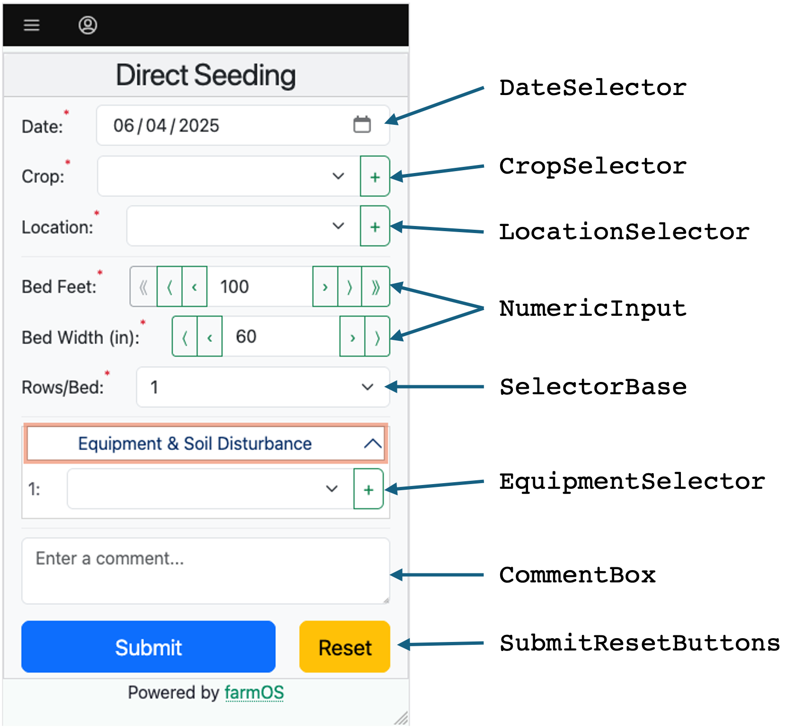

# Working on Vue.js Components

The purpose of this document is to describe how to create, change and test custom Vue components in FarmData2.

Familiarity with the [Quick Tour of FarmData2](tour.md) and the [Overview of the FarmData2 Codebase](codebase.md) will be helpful in reading this document

## Components in an Entrypoint

FarmData2 uses custom Vue Components to create its entrypoints. For example, the following screenshot shows the components that are used in the Direct Seeding entrypoint.

Using custom Vue components increases user interface consistency across entrypoints, reduces code duplication, and makes it possible to test the component functionality isolation.

## Existing Components

A complete list of the available components can be found on the [FarmData2 Documentation](../FarmData2.md) page.

Clicking on the name of a component will take you to the complete documentation for that component.

The documentation for each component also contains a link to an example page with a live version of the component. The example page for a component can be used to learn about, experiment with and manually test the component.

The live example pages are also available from the [Components option](http://farmos/fd2_examples/component_examples) on the FD2 Examples menu in farmOS.

## Creating a New Component

The `addComponent.bash` script is used to create a new Vue.js component in FarmData2. This script uses templates to create the new component, starter files for the component tests, and a basic example page for the component. The new component, tests and example page provide the basic framework for creating and testing a new component.

The `addComponent.bash` script is run in the FD2 development environment with the command:

`addComponent.bash ComponentName`

Replace _`ComponentName`_ with the name of the new component that you want to create. The name must be at least two words and must be in _UpperCamelCase_.

The script will create new directory with the name `ComponentName` in the `components/` directory that contains the starter code for the new component. The newly created component just displays the following text:

The script also creates an example page for the new component that can be accessed via the [Components option](http://farmos/fd2_examples/component_examples) on the FD2 Examples menu in farmOS.

The code for the example page is located in a new directory with the name `component_name` in the `modules/farm_fd2_examples/src/entrypoints/` directory containing the starter code for the example page for the new component. The newly created example page displays the component and some other content that will be common to all example pages.

The following sections describe the starter code for the new component and its example page, and point to other useful examples.

## The Component Starter Code

The source code for the new component will be in the `components/ComponentName` directory, where `ComponentName` will be replaced by the component's name. You will edit the files in this directory to change the component's content and behavior, and to test it.

This directory will contain the following files:

- `ComponentName.vue` - this is the `.vue` file that defines the component. This file contains extensive comments that document the structure and purpose of the different elements of the component. A few other components that provide good examples for learning are:
  - [`DateSelector.vue`](../../components/DateSelector/DateSelector.vue) - this is a good next example to study. It illustrates how to add a BootstrapVueNext component, how to add new `prop`s, how to maintain the state of the component in the `data`, how to update that state when a `prop` changes, how to emit an event when the component's value changes, and how the `valid` and `showValidityStyling` computed properties can be written.
  - [`TraySizeSelector.vue`](../../components/TraySizeSelector/TraySizeSelector.vue) - this is a good example to study to see how a component can request and incorporate data from farmOS.
- `ComponentName.content.comp.cy.js` - this file contains tests that check the basic content of the component and that the values of props are passed into the component.
  - [`DateSelector.content.comp.cy.js`](../../components/DateSelector/DateSelector.content.comp.cy.js) provides a few good examples to get started.
- `ComponentName.behavior.comp.cy.js` - this files contains tests that check the behavior of the component in response to changes in props or user interaction.
  - [`DateSelector.behavior.comp.cy.js`](../../components/DateSelector/DateSelector.behavior.comp.cy.js) provides a few good examples of changing props to get started.
  - [`PickerBase.behavior.comp.cy.js`](../../components/PickerBase/PickerBase.behavior.comp.cy.js) provides a few good examples of testing behavior based on user interaction.
- `ComponentName.events.comp.cy.js` - this file contains tests that check that the component emits the correct events at the correct times.
  - [`DateSelector.events.comp.cy.js`](../../components/DateSelector/DateSelector.events.comp.cy.js) provides a few good examples of how to test for emitted events.
- `ComponentName.styling.comp.cy.js` - this file contains tests that check that the validity styling is correctly applied to the component.
  - [`DateSelector.styling.comp.cy.js`](../../components/DateSelector/DateSelector.styling.comp.cy.js) illustrates a an exhaustive approach to testing the application of validity styling.

### Removing Comments from Component Starter Code

If you are already familiar with creating components you can remove the instructive comments from the starter code with the `removeComments.bash` script.

Change into the subdirectory of `components/` for your new component and run the following command, replacing `ComponentName` with the name of your new component.

`removeComments.bash ComponentName.vue`

### Running the Component Tests

The component tests for the an individual component can be run by replacing `ComponentName` in the following commands with the name of your component:

- Run all the tests for the component:

  `test.bash --comp --glob=components/ComponentName/*.comp.cy.js`

  Appending a `--gui` flag to any `test.bash` command will cause the tests to be run in the Cypress GUI.

- Run just the `content` tests for the component:

  `test.bash --comp --gui --glob=components/ComponentName/*.content.comp.cy.js`

  Similar commands can be used to run the `behavior`, `events`, or any other specific set of tests.

## The Example Page Starter Code

The source code for the new component's example page will be in the `modules/farm_fd2_examples/src/entrypoints/new_component/` directory, where `new_component` is replaced with the _snake_case_ version of the component's name. You will edit the files in this directory to change the example page's content and behavior as you develop and test the new component.

This directory will contain the following files:

- `App.vue` - this is the `.vue` file that defines the example page for the component. This file contains extensive comments that document the structure and purpose of the different elements of the example page. The goal of the example page is to enable the component to be tested manually. Thus, the example page should display the component, provide controls for the component's props and display any of the emitted events that are under the user's control. Exploring the other example pages to see what they provide is a good way to get started. Some good example pages to begin with might be:
  - `DateSelector` - one of the simpler examples and a good place to start with understanding the example pages.
    - [source](../../modules/farm_fd2_examples/src/entrypoints/date_selector/App.vue)
    - [live example](http://farmos/fd2_examples/date_selector/)
  - `BedPicker` - a little more complex example with a few more props that require controls.
    - [source](../../modules/farm_fd2_examples/src/entrypoints/bed_picker/App.vue)
    - [live example](http://farmos/fd2_examples/bed_picker/)
  - `LocationSelector` - a more complex example with many prop controls and events.
    - [source](../../modules/farm_fd2_examples/src/entrypoints/location_selector/App.vue)
    - [live example](http://farmos/fd2_examples/location_selector/)
- `component_name.exist.e2e.cy.js` - a test that checks that the example page exists and can be displayed. No changes are needed to this file.
- `index.html`, `component_name.html`, and `component_name.js` - boiler plate code that is necessary to display the example page. No changes are needed in these files.

### Removing Comments from Example Page Starter Code

The instructive comments can be removed from the example starter code by changing into the subdirectory of `modules/farm_fd2_examples/src/entrypoints/` containing your new example page and running the following command.

`removeComments.bash App.vue`
