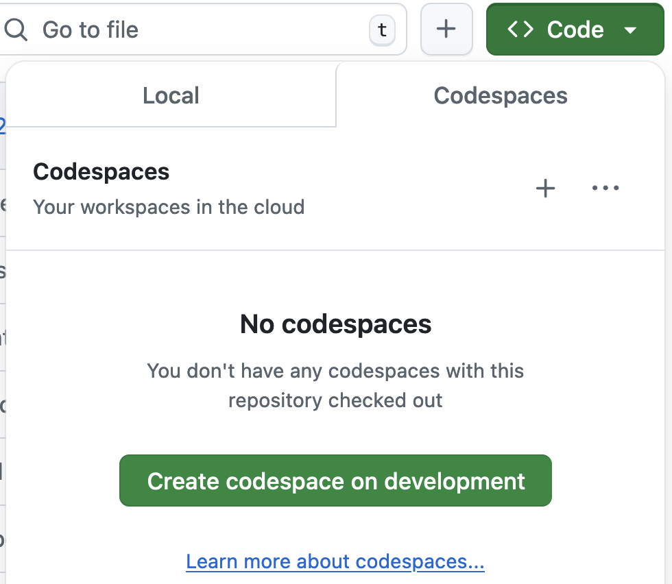
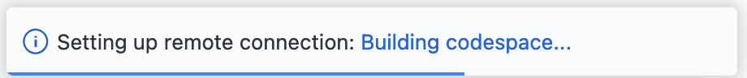
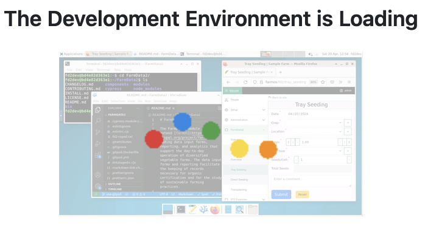
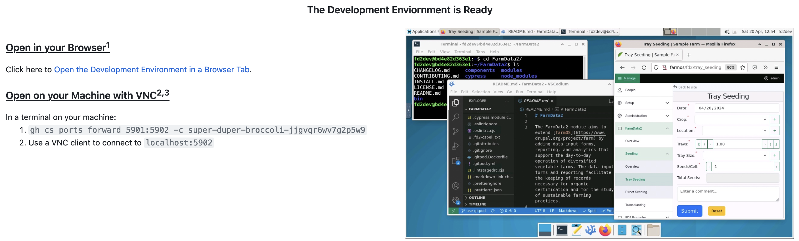
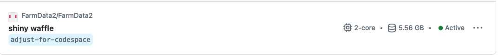

<!-- eslint ignore - title is as short as possible -->

# Running the FarmData2 Development Environment in GitHub Codespaces

When a FarmData2 Development Environment is run in GitHub Codespaces you will use your browser or a VNC client to connect to the Linux-based desktop.

If you are already familiar with Codespaces, running the FarmData2 Development Environment will be a different experience than what you are used to. Codespaces is used to run the containers that provide the Linux desktop based development environment used by FarmData2.

## Install Help

If you run into problems during the install visit the dedicated [install channel](https://farmdata2.zulipchat.com/#narrow/stream/270906-install) on the [FarmData2 Zulip chat](https://farmdata2.zulipchat.com). Use the search feature to see of others have had and solved the problem you are experiencing. If you do not find a solution, post a summary of your problem and the community will help.

## Creating a FarmData2 Development Environment in Codespaces

Creating a new FarmData2 Development Environment in Codespaces will take about 10 minutes. When you restart an existing development environment it will be much faster.

Use the following steps to create a new FarmData2 Development Environment in Codespaces:

1. Log in to GitHub.

1. [Create a (classic) Personal Access Token (PAT)] in GitHub with the `repo`, `workflow`, `read:org` and `codespace` scopes selected. Choose an expiration date that is appropraite for the work you plan to do. __Be sure to copy and paste your token somewhere safe.__ You'll need it later and you cannot retrieve again after you leave the creation page.

1. Visit the [Codespace settings page](https://github.com/settings/codespaces). Scroll down and adjust the "Default Idle Timeout" setting. This is the amount of time the codespace will continue running if you are not interacting with the development environment. 15 minutes is a good balance that ensures the development environment is not shutdown too soon, but also does not waste your free usage.

1. Fork the [upstream FarmData2 repository](https://github.com/FarmData2/FarmData2) in GitHub.

1. Visit your fork of FarmDat2 in GitHub.

1. Click the <!-- vale RedHat.DoNotUseTerms = NO : the button label is also given -->green<!-- vale RedHat.DoNotUseTerms = YES --> "Code" button: 

1. Click the "Codespaces" tab and then click the <!-- vale RedHat.DoNotUseTerms = NO : the button label is also given -->green<!-- vale RedHat.DoNotUseTerms = YES --> button labeled "Create codespace on development."  

1. The browser will display a small dialog box in the lower right corner indicating that the GitHub codespace is being built. 

1. After about 5 minutes the browser window will change a couple of times and then display a page indicating that the FarmData2 Development Environment is loading. 

1. After another 5-10 minutes the browser window will display a page giving information about connecting to the FarmData2 Development Environment. 

1. Connect to the FarmData2 Development Environment in one of the following ways:

   1. **Open in your Browser:** This is the fastest and easiest way to connect, but has the limitation that you will not be able to copy and paste information directly between the FarmData2 Development Environment and your local machine.
      - Click the link provided on the "The FarmData2 Development Environment" page in your browser under the "Open in your Browser" heading.
      - The FarmData2 Development Environment will open in a new browser tab.
   2. **Open on your Machine with VNC:** If you will want to copy and paste information between the FarmData2 Development Environment and your local machine frequently, this is the best way to connect.
      - Confirm that the following dependencies are installed on your machine:
        - [The `gh` command line interface](https://cli.github.com/)
        - [The Tiger VNC Viewer](https://sourceforge.net/projects/tigervnc/files/stable/1.13.0/)
          - For Windows, download and run the `vncviewer64.1.13.0.exe` file.
          - For Mac, download and open the `TigerVNC.1.13.0.dmg` file and then copy the "TigerVNC Viewer" to your Applications folder.
          - Note: Newer versions of the Tiger VNC Viewer might work, but have not been tested.
      - Follow the directions provided on the "The FarmData2 Development Environment" page in your browser under the "Open on your Machine with VNC" heading.

1. Follow the directions to [Setup the FarmData2 Development Environment](setup.md).

1. See the [Working in the FarmData2 Development Environment](working.md) document for more information about working in the FarmData2 Developer Environment in a browser or a VNC client.

## Stopping a FarmData2 Development Environment in Codespaces

In practice you can just close the development environment by closing its browser tab or VNC window. The development environment containers running on GitHib Codespaces will automatically stop after the idle timeout that you set earlier.

If you are close to, or have already, exhausted your free Codespaces time you might want to explicitly stop the FarmData2 codespace to avoid incurring charges until the idle timeout expires.

To explicitly stop the FarmData2 Development Environment in GitHub Codespaces:

1. Log in to GitHub.
1. Go to your [Codespaces page](https://github.com/codespaces).
1. Scroll down to the entry your FarmData2 codespace.  

1. Click the _meatballs menu_ (⋯) to the right side of the word "Active."
1. Choose "Stop codespace" from the menu.
   - Note: If your Codespaces page was open when you started the FarmData2 codespace you might need to reload the page to see the "Active" indicator and the "Stop codespaces" option.

## Restarting a FarmData2 Development Environment in Codespaces

The FarmData2 Development Environment will restart much faster
after you have created the GitHub Codespace.

To restart the Development Environment:

1. Log in to GitHub.
1. Go to your [Codespaces page](https://github.com/codespaces).
1. Scroll down to the entry your FarmData2 codespace.  

1. Click the _meatballs menu_ (⋯) to the right side of the word "Active."
1. Choose "Open in Browser" from the menu.
   - Note: As a shortcut, you can also click the _codespace name_, for example "shinny waffle," that is displayed under the repository name.
