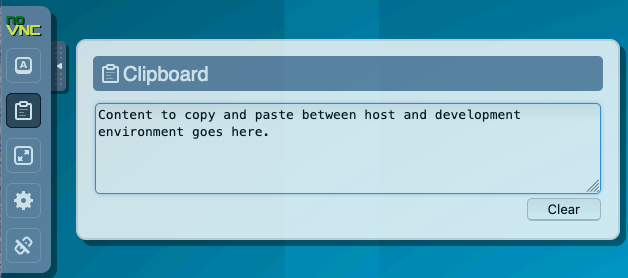

# Working in the FarmData2 Development Environment

The FarmData2 Development Environment is a fully containerized Linux-based desktop for working on the FarmData2 project. Using this FarmData2 Development Environment ensures that you have the correct versions of all the tools, libraries and other dependencies needed to do FarmData2 development.

**The Linux-based FarmData2 Development Environment.**

Instructions for installing and connecting to the FarmData2 Development Environment can be found in the [INSTALL document](../../INSTALL.md).

## Accessing the FarmData2 Application

Once you have connected to the FarmData2 Development Environment you can access the farmOS application (including the FarmData2 module) by connecting the browser to: `http://farmdata2`. The [farmOS Credentials](#farmos-credentials) can be used to log in to the farmOS application.

## FarmData2 Development Environment Credentials

The FarmData2 Development Environment has two types of credentials:

- The [Linux Credentials](#linux-credentials) apply to the user within the FarmData2 Development Environment.
- The [farmOS Credentials](#farmos-credentials) apply to logging into the farmOS instance that is running in the FarmData2 Development Environment.

### Linux Credentials

When connecting to the FarmData2 Development Environment you will be automatically Logged into the Linux system with the following credentials:

- User: `fd2dev`
- Pass: `fd2dev`

The `fd2dev` user belongs to the following groups::

- `fd2docker` - allowing it to run docker commands by using the host's docker daemon.
- `fd2dev` - allowing it to change files mounted from the host.
- `sudo` - allowing it to run commands as root.

### farmOS Credentials

You can log in to the farmOS instance running in the FarmData2 Development Environment by connecting the browser to:

- [http://farmos](http://farmos)

and by using any of the following credentials:

- The Drupal Admin User:
  - User: `admin`
  - Pass: `admin`
- A farmOS Farm Manager:
  - User: `manager1` (or `2`)
  - Pass: `farmdata2`
- A farmOS Farm Worker:
  - User: `worker1` (or `2`, `3`, `4`, `5`)
  - Pass: `farmdata2`
- A farmOS Guest:
  - User: `guest`
  - Pass: `farmdata2`

The farmOS users correspond to the [default managed roles defined by the farmOS application](https://farmos.org/guide/people/).

## Copy and Paste

The FarmData2 Development Environment is Linux-based and uses the Linux conventions for [copying and pasting within the development environment](#copy-and-paste-within-the-development-environment).

The method for [copy and pasting between the host machine and the development environment](#copy-and-paste-to-and-from-host-machine) depends on whether the development environment is being [accessed in the browser](#when-connected-in-the-browser) or by [using a VNC client](#when-connected-using-a-vnc-client).

### Copy and Paste within the Development Environment

The FarmData2 Development Environment is Linux-based and uses the following Linux conventions when copying and pasting within the development environment:

- Within a terminal window:
  - Copy: `CTRL+SHIFT+C`
  - Paste: `CTRL+SHIFT+V`
- Within any other application:
  - Copy: `CTRL+C`
  - Paste: `CTRL+V`

### Copy and Paste to and from Host Machine

#### When Connected in the Browser

When connected to the development environment in the browser you must use the _noVNC clipboard_ to copy and paste between the host machine and the development environment. The noVNC clipboard is accessed from the _noVNC Menu_ at the left edge of the desktop.

To copy from the host into the development environment:

1. Copy the text from the host operating system with the host operating system's copy command.
1. Open the noVNC Clipboard.
1. Paste the copied text into the noVNC Clipboard with the host operating system's paste command.
1. Paste the text into the development environment with the development environment's paste command (`CTRL-V` or `CTRL-SHIFT-V`).

To copy from the development environment into the host:

1. Copy the text from the development environment with the development environment's copy command (`CTRL-C` or `CTRL-SHIFT-C`).
1. Open the noVNC Clipboard.
1. Copy the text from the noVNC Clipboard with the host operating system's copy command.
1. Paste the copied text into the host operating system with the host operating system's paste command.

#### When Connected using a VNC Client

When connected to the development environment in a VNC client, copy and paste is more natural. Use the host operating system's commands to copy and paste on the host and the Linux copy and paste commands (`CTRL-C` or `CTRL-SHIFT-C`) to copy and paste in the development environment.
